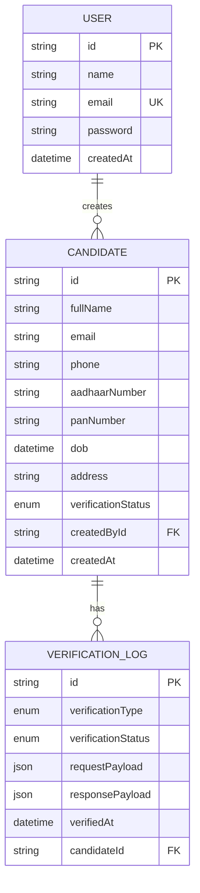

# VeriSure

VeriSure is a full-stack background verification platform designed to manage candidate identity verification workflows in a secure and structured environment.

The platform enables organizations, evaluators, or HR teams to create candidate profiles, run identity verification checks, monitor verification status, maintain audit logs, and generate downloadable PDF reports.

---

## Live Application

### Frontend

https://veri-sure-gamma.vercel.app

### Backend API

https://verisure-backend.onrender.com/api

---
## Project Overview

VeriSure provides an end-to-end workflow for secure candidate verification.

The system allows users to:

- Register and authenticate securely
- Create and manage candidate profiles
- Perform Aadhaar and PAN verification
- Track verification logs and status updates
- View candidate verification timelines
- Generate professional verification reports
- Download reports as PDF
- Monitor verification statistics through a dashboard

The application follows a clean full-stack architecture using a Next.js frontend, Express backend, Prisma ORM, and PostgreSQL database.

---

## Key Features

### Authentication

- Secure user registration and login
- JWT-based authentication
- Password hashing using bcrypt
- Protected routes and APIs

### Candidate Management

- Create candidate profiles
- Update candidate details
- Delete candidate records
- View detailed candidate information

### Verification Workflow

- Aadhaar verification simulation
- PAN verification simulation
- Automated verification status updates

Supported statuses:

- `PENDING`
- `VERIFIED`
- `FAILED`
- `PARTIAL`

### Verification Logs

- Stores verification history
- Tracks timestamps
- Displays verification timeline

### Reports

- Professional verification report preview
- Downloadable PDF reports
- Masked sensitive identity details

### Dashboard

- Total candidates
- Verified candidates
- Pending verifications
- Failed verifications
- Partial verifications
- Recent activity overview

### Demo Workspace

- Generate realistic demo candidate data
- Reset workspace for evaluation and testing

---

## Tech Stack

### Frontend

- Next.js
- TypeScript
- Tailwind CSS
- React Hook Form
- Zod
- Axios
- Sonner
- Lucide React

### Backend

- Node.js
- Express.js
- TypeScript
- Prisma ORM
- JWT Authentication
- bcrypt

### Database

- PostgreSQL (Neon)

### Deployment

- Frontend: Vercel
- Backend: Render

---

## System Architecture

```txt
Client (Next.js - Port 3000)
            │
            ▼
REST API (Express.js - Port 3001)
            │
            ▼
Prisma ORM
            │
            ▼
PostgreSQL Database (Neon)
```
---
## ER Diagram


---
## Database Design

### User

Stores authenticated users.

| Field | Type |
|--------|------|
| id | String |
| name | String |
| email | String |
| password | String |
| createdAt | DateTime |

### Candidate

Stores candidate identity details.

| Field | Type |
|--------|------|
| id | String |
| fullName | String |
| email | String |
| phone | String |
| aadhaarNumber | String |
| panNumber | String |
| dob | DateTime |
| address | String |
| verificationStatus | Enum |
| createdById | String |
| createdAt | DateTime |

### VerificationLog

Stores Aadhaar and PAN verification logs.

| Field | Type |
|--------|------|
| id | String |
| verificationType | Enum |
| verificationStatus | Enum |
| requestPayload | JSON |
| responsePayload | JSON |
| verifiedAt | DateTime |
| candidateId | String |

---

## Verification Workflow

```txt
Create Candidate
        │
        ▼
Start Aadhaar & PAN Verification
        │
        ▼
Verification Logs Stored
        │
        ▼
Candidate Status Updated
        │
        ▼
Generate Verification Report
        │
        ▼
Download PDF Report
```

---

## Folder Structure

```txt
VeriSure/
│
├── client/                         # Frontend (Next.js)
│   ├── public/
│   ├── src/
│   │   ├── app/
│   │   ├── components/
│   │   ├── features/
│   │   ├── services/
│   │   ├── lib/
│   │   └── types/
│
├── server/                         # Backend (Express + Prisma)
│   ├── prisma/
│   ├── src/
│   │   ├── config/
│   │   ├── controllers/
│   │   ├── middleware/
│   │   ├── routes/
│   │   ├── services/
│   │   ├── validations/
│   │   └── utils/
│
├── API_DOCUMENTATION.md
└── README.md
```

---

## Local Setup

### Clone Repository

```bash
git clone <repository-url>
cd VeriSure
```

---

### Backend Setup

Navigate to server:

```bash
cd server
```

Install dependencies:

```bash
npm install
```

Create `.env`:

```env
DATABASE_URL=your_database_url
JWT_SECRET=your_jwt_secret
PORT=3001
CLIENT_URL=http://localhost:3000
```

Generate Prisma client:

```bash
npx prisma generate
```

Run migrations:

```bash
npx prisma migrate dev
```

Start backend:

```bash
npm run dev
```

Backend runs on:

```txt
http://localhost:3001
```

---

### Frontend Setup

Navigate to client:

```bash
cd client
```

Install dependencies:

```bash
npm install
```

Create `.env.local`:

```env
NEXT_PUBLIC_API_URL=http://localhost:3001/api
```

Start frontend:

```bash
npm run dev
```

Frontend runs on:

```txt
http://localhost:3000
```

---

## API Documentation

Detailed API documentation is available in:

```txt
API_DOCUMENTATION.md
```

---

## Security Measures

- JWT authentication
- Password hashing using bcrypt
- Protected routes
- Request validation using Zod
- Sensitive identity masking
- Secure database access using Prisma ORM
- CORS protection

---

## Future Improvements

- Real Aadhaar and PAN API integration
- Role-based access control
- Email notifications
- Advanced analytics
- Verification retry mechanism
- Exportable audit logs

---

## Author

**Tejaswini Palwai**  
Full Stack Developer
